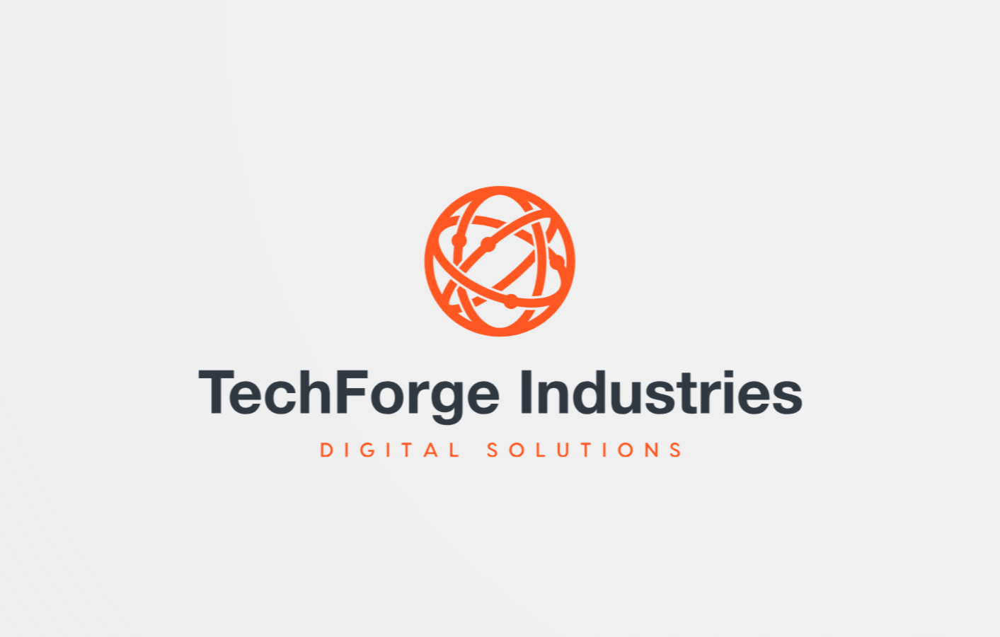

# 🤖 TechForge Industries - Digital Solutions For You 🤖

# AI Tools Evaluation Report for TechForge Industries

## Executive Summary

This report evaluates three AI-powered tools: Tabnine for general development, UIZARD for UI/UX design, and TestFirst for test management. Each tool offers significant potential to enhance productivity, streamline workflows, and improve output quality across different aspects of the software development lifecycle at TechForge Industries.

Key findings:

- Tabnine can automate 30-50% of code creation, potentially saving significant development time.
- UIZARD can accelerate the design process and improve cross-functional collaboration.
- TestFirst promises to increase testing efficiency and reduce costs associated with late-stage bug fixes.

While these tools present some risks, such as over-reliance on AI-generated content and potential learning curves, the benefits outweigh the drawbacks when implemented strategically.

## Introduction

As TechForge Industries seeks to maintain its competitive edge in the fast-paced tech industry, adopting AI-powered tools has become increasingly crucial. This report examines three such tools that could potentially transform our development, design, and testing processes:

1. Tabnine: An AI-powered code completion tool
2. UIZARD: An AI-assisted UI/UX design platform
3. TestFirst: A cloud-based test management system

Each tool will be evaluated based on its opportunities, risks, and tangible benefits to TechForge Industries.

## Tool Evaluations

### 1. Tabnine

Tabnine enhances the coding experience with intelligent code completion, error detection and fixes, refactoring assistance, and automatic code documentation.

**Opportunities:**

- Automates 30-50% of code creation
- Reduces errors through context-aware suggestions
- Improves code consistency and quality

**Risks:**

- Potential over-reliance on AI suggestions
- Occasional inaccurate suggestions

**Tangible Benefits:**

- Cost savings through reduced coding time and fewer bugs
- Increased productivity and code output
- Early error detection during development
- Code input is private and is not used to train the model **Privacy is of upmost importance**

### 2. UIZARD

UIZARD is an AI-powered UI/UX design tool that can generate design mockups from low-fidelity sketches, existing images, or text descriptions.

**Opportunities:**

- Rapid wireframing and prototyping
- AI-powered theme generation and responsive design
- Design-to-code functionality (React)

**Risks:**

- Potential for over-reliance on templates
- Possible limitations in design complexity

**Tangible Benefits:**

- Significantly speeds up the initial design process
- Enhances collaboration between design and development teams
- Potential reduction in time-to-market for products

### 3. TestFirst

TestFirst is a cloud-based test management system that helps QA and development teams manage their testing process efficiently.

**Opportunities:**

- Automates tests with plain language pseudocode
- Centralises test execution, reporting, and version control integration
- Improves collaboration between QA and other teams

**Risks:**

- Dependency on cloud-based platforms
- Potential learning curve for new team members

**Tangible Benefits:**

- Increased productivity through automated workflows
- Reduced costs associated with late-stage defect fixes
- Improved communication between QA and other teams

## Conclusion

The evaluated AI tools present significant opportunities for TechForge Industries to enhance its development processes:

1. **Tabnine** can substantially reduce coding time and improve code quality.
2. **UIZARD** can accelerate the design process and bridge the gap between design and development.
3. **TestFirst** can streamline the testing process and improve defect detection.

**While each tool comes with potential risks, these can be mitigated through careful implementation and clear usage guidelines.**

## Recommendations

1. **Tabnine:** Implement a trial period for Tabnine, focusing on fast-paced development teams. Provide training to ensure developers use the tool effectively without becoming overly reliant on AI suggestions.
2. **UIZARD:** Adopt UIZARD for rapid prototyping and initial concept development. Start with a pilot team or project, and expand usage based on success and ROI. Establish guidelines to ensure AI-generated designs serve as starting points for further customization.
3. **TestFirst:** Begin with a trial implementation of TestFirst, focusing on security compliance and team training. Integrate it gradually into the existing testing workflow, measuring its impact on efficiency and defect detection rates.
4. **General:** For all tools, establish clear usage guidelines, provide comprehensive training, and regularly assess their impact on productivity, quality, and team satisfaction. Continuously monitor for any negative effects, such as skill atrophy or over-reliance on AI.

By implementing these AI-powered tools, TechForge Industries can significantly enhance its development processes, leading to faster time-to-market, improved product quality, and increased team productivity.
